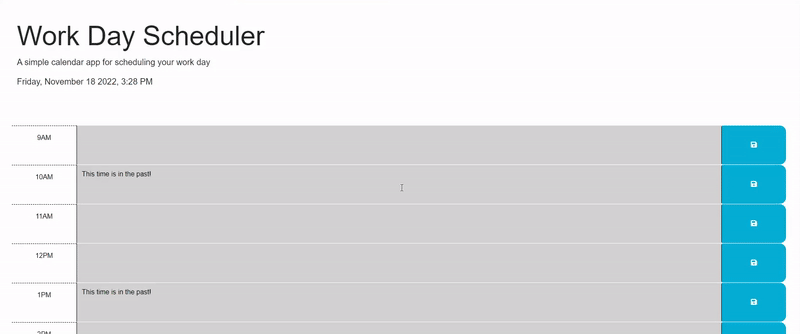

# Plan for Me

## Description

Plan for Me is a site designed to help the average individual create a schedule for a busy day. Everyone can find themselves in a snafu trying to manage their lives. Loosen that bind by recording your TODOs for the work day in this scheduler. 

This project was a great opportunity to familiarize myself with both the JQuery and dayjs libraries. They were vital tools in accomplishing this task. I look forward to finding ways to sneak them into future projects.  

## Usage

Below is a short demo of the site: 

## License

[MIT License](https://github.com/JPauldo/plan-for-me/blob/main/LICENSE).

Why not make yourself [a personal schedule](jpauldo.github.io/plan-for-me)? 
